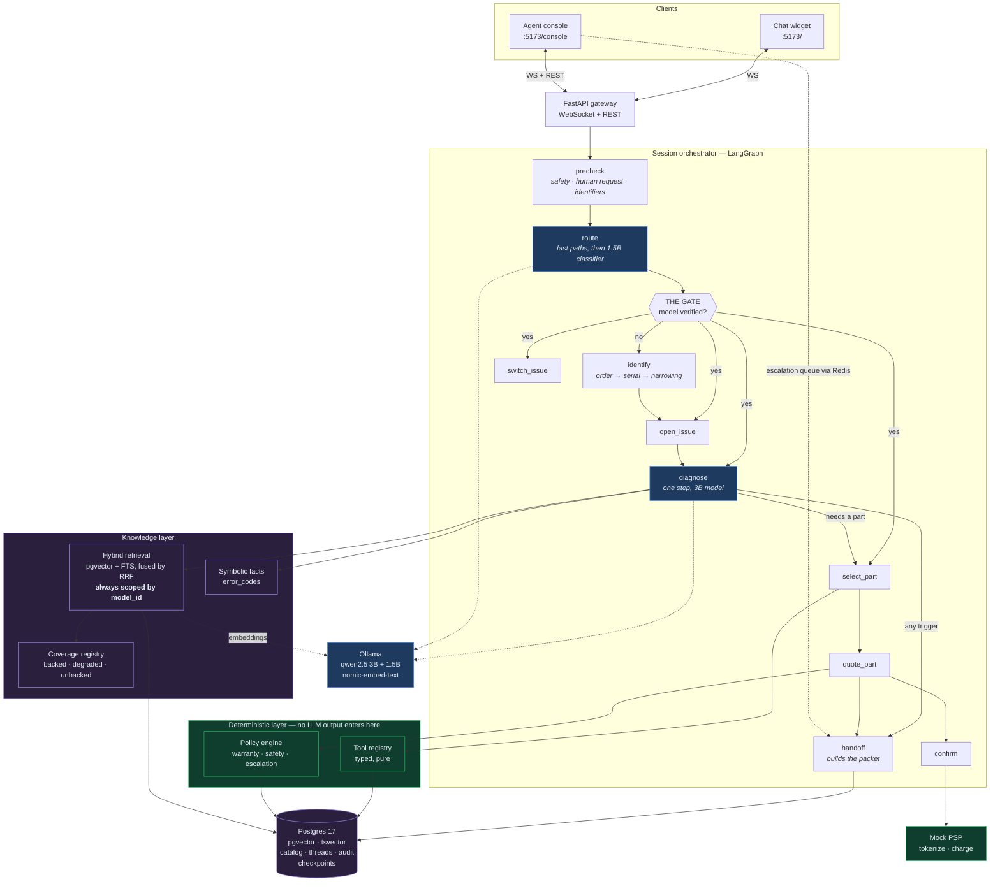
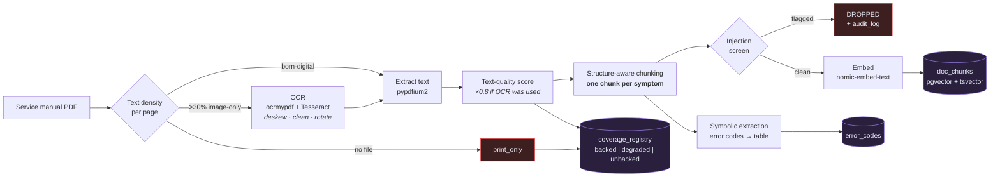
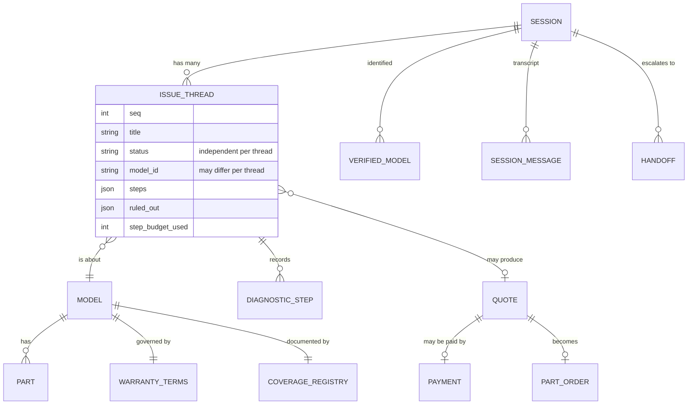
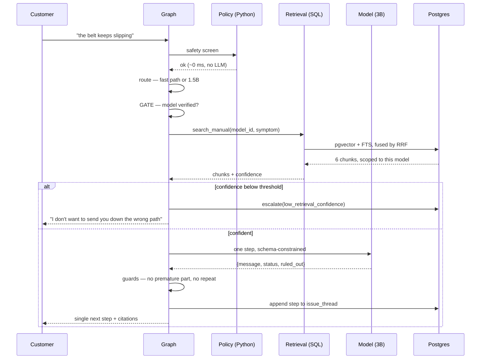

# Diagrams

Mermaid source. GitHub renders these inline.

## System architecture

Green is deterministic, blue involves a model, purple is storage. The commerce
path is entirely green — that is the point.

## Ingestion pipeline

## The multi-issue state model

The critical detail: `model_id` and `status` live on the **thread**, not the
session. That is what lets one session hold a resolved treadmill issue and an
escalated bike issue at the same time.

## A diagnostic turn

